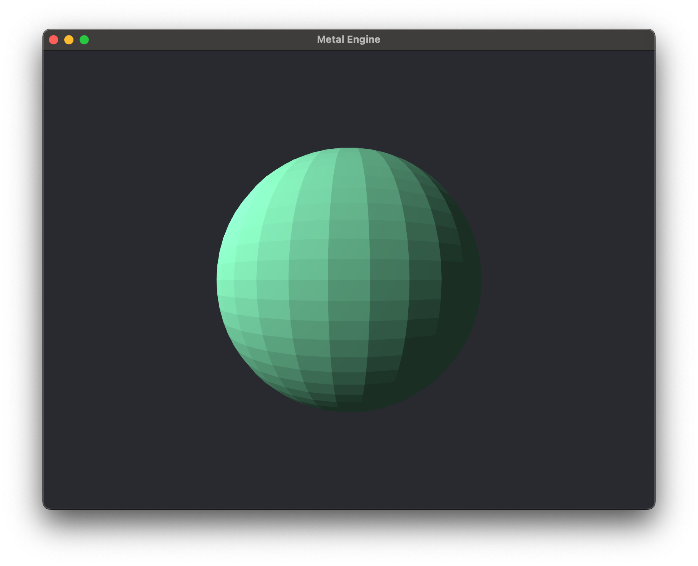
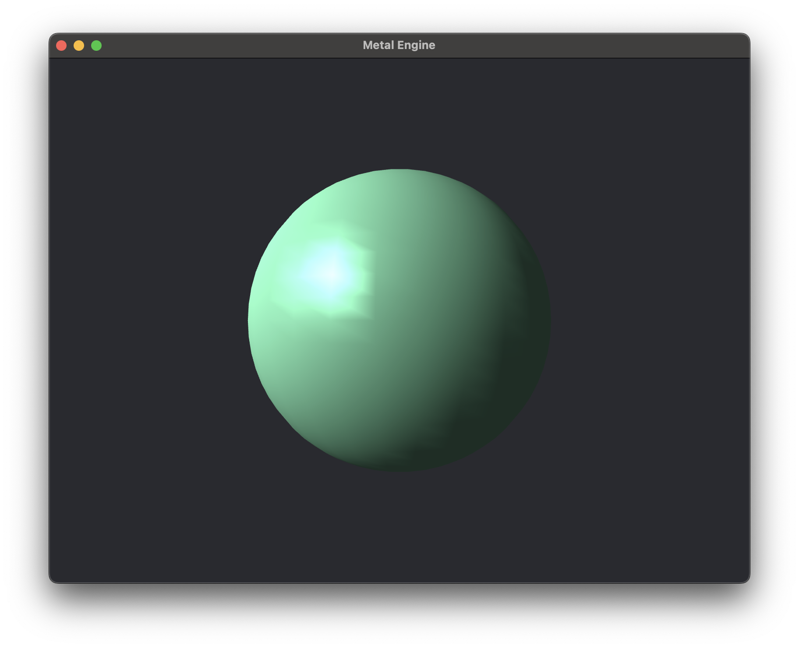
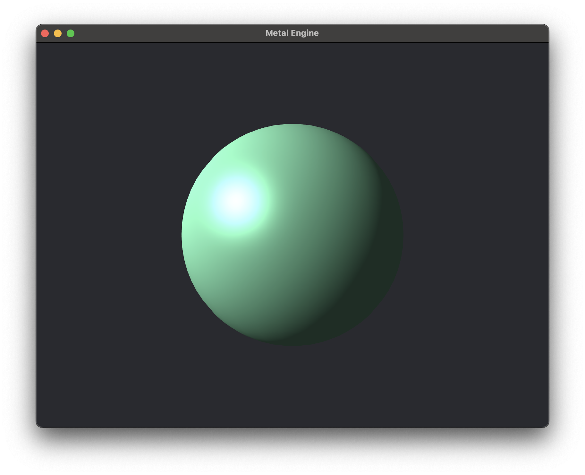

# Lighting

Lighting in Computer Graphics is a fascinating topic. Within it, we have a variety of shading "models". A shading model, or shading algorithm, is simply a method used to simulate the appearance of surfaces under light sources. It defines how the color of each pixel on the surface is calculated based on the lighting model and the material properties of the surface. It typically takes into account the geometry of the surface, the viewer's perspective, and the lighting environment to compute the final color displayed on the screen. To start, let's briefly discuss some of the major shading models that exist within Computer Graphics, as well as the differences between them, roughly in order of complexity:

## Shading Models
1. Flat Shading
2. Gouraud Shading
3. Phong Shading
4. Blinn-Phong Shading
5. Deferred Shading
6. Phsyically Based Rendering (PBR)
7. Ray-Tracing

### Flat Shading
Flat shading is the most basic form of shading used within Computer Graphics. It is typically done by calculating the lighting for just one normal vector per face (the normal that is perpendicular to the face), rather than at every vertex. 

### Gouraud Shading
...

### Phong Shading
...

### Flat vs Gouraud vs Phong Shading

### Blinn-Phong Shading
...

Full write-up soon to come! For now, the code is accessible on the [GitHub repository](https://github.com/wmarti/MetalTutorial/) under branch Lesson_2_2, and here is the finished product:

